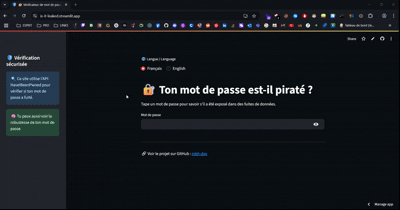

# 🔐 Password Leak Checker with Python & Streamlit


---



🔗 **Live Demo:** [https://is-it-leaked.streamlit.app/](https://is-it-leaked.streamlit.app/)


---

## 📌 What is this project?

This is a simple and interactive **Password Leak Checker** app built with **Python** and **Streamlit** that helps you:

- 🔍 Check if your password has been exposed in data breaches using the **HaveIBeenPwned API**  
- 🧠 Evaluate the **strength of your password** based on length, case, digits, and symbols  
- 🌍 Switch between **English and French** interface  
- 🔗 Explore the project on GitHub

---


## 🧰 Technologies Used

| Tool          | Purpose                                |
|---------------|--------------------------------------|
| `Python`      | Main programming language             |
| `Streamlit`   | Web app frontend & UI components      |
| `Requests`    | HTTP client for API calls             |
| `re`          | Regex for password strength checking  |

---

## 🚀 What You Will Learn

✅ How to build an interactive web app quickly with Streamlit  
✅ How to connect to external APIs securely (HaveIBeenPwned)  
✅ How to analyze password complexity using Python regex  
✅ How to handle multilingual UI in Streamlit  
✅ How to deploy your Python app live on Streamlit Cloud

---

## 🛠 How It Works

1. You enter a password into the input field 🔑  
2. The app calculates a **strength score** based on rules (length, uppercase, digits, symbols) 🧠  
3. It queries the **HaveIBeenPwned API** anonymously to see if your password has appeared in data leaks 🚨  
4. Displays results with **colorful indicators** and helpful messages  
5. You can switch UI language between English and French anytime 🌐

---

## 📦 Setup Instructions

### 1. Clone the repository

```bash
git clone https://github.com/mkh-dev/password-leak-checker.git
cd password-leak-checker
````

### 2. Create and activate a virtual environment (optional but recommended)

```bash
python -m venv env
# Windows
.\env\Scripts\activate
# macOS/Linux
source env/bin/activate
```

### 3. Install dependencies

```bash
pip install streamlit requests
```

### 4. Run the app locally

```bash
streamlit run app.py
```

Open your browser at `http://localhost:8501` and enjoy!

---

## 🧩 Code Structure Explained

| Part                  | Description                                 |
| --------------------- | ------------------------------------------- |
| `pwned_api_check()`   | Function that checks password hash on API   |
| `password_strength()` | Computes password score based on complexity |
| `st.radio()`          | Language selector widget                    |
| `st.text_input()`     | Password input box                          |
| `st.progress()`       | Visual strength meter                       |
| `st.sidebar`          | Sidebar with info and GitHub link           |

---

## 🧠 Password Strength Logic (Simplified)

* +1 point if length ≥ 8
* +1 point if contains uppercase letters
* +1 point if contains lowercase letters
* +1 point if contains digits
* +1 point if contains special symbols (like !@#\$%^&\*)

Scores 0-5 map to levels: Very Weak → Excellent

---

## ⚠️ Troubleshooting

* If you get module errors, run:

  ```bash
  pip install --upgrade pip
  pip install streamlit requests
  ```
* API might rate-limit you if too many requests are sent rapidly
* Make sure your internet connection is active

---

## 🎉 Bonus Ideas to Improve

| Idea                      | Description                                |
| ------------------------- | ------------------------------------------ |
| Password Generator        | Add a button to generate a strong password |
| Dark Mode                 | Add toggle for dark/light themes           |
| Password History          | Save tested passwords in session or local  |
| Deploy on Streamlit Cloud | Free hosting with live demo                |

---

## 🤝 Contributing

Feel free to open issues or PRs to add features, fix bugs or improve docs!
Your contributions help everyone stay safer online! 🙌

---

## 📜 License

This project is licensed under the MIT License.

---

## 🔗 Links

* GitHub: [https://github.com/mkh-dev/password-leak-checker](https://github.com/mkh-dev/password-leak-checker)
* API Docs: [HaveIBeenPwned API](https://haveibeenpwned.com/API/v3)

---

## 🌈 Final Thoughts

> "A strong password protects your data — always check before you reuse!" 🔐✨

---

Created with ❤️ by [mkh-dev](https://github.com/mkh-dev)
